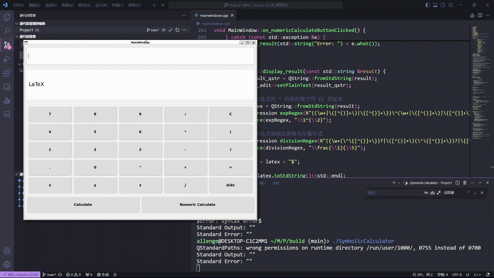
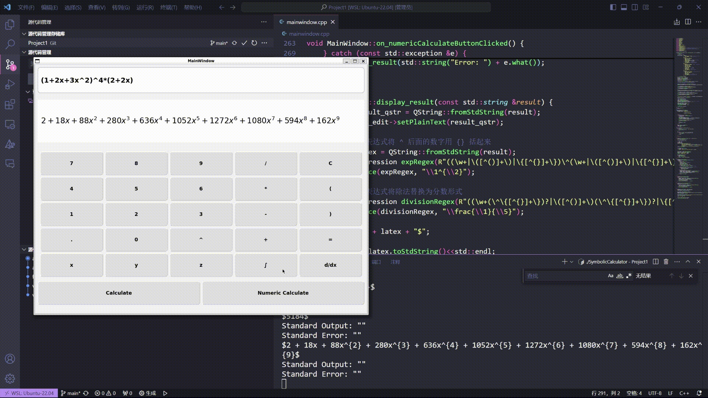
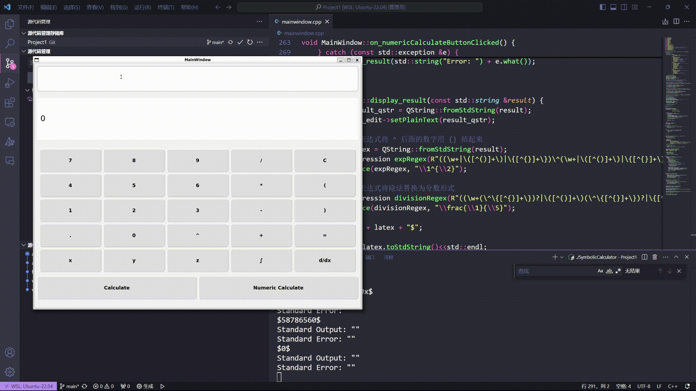
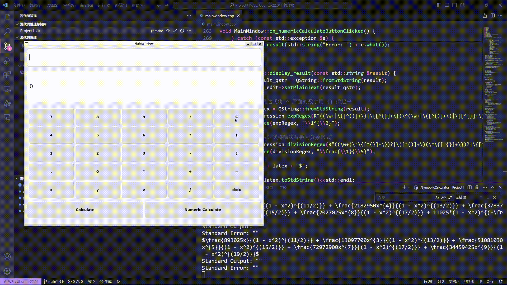

# My_Cpp_Calculator

A visual symbolic and numeric calculator implemented in C++.

## Table of Contents

- [Running](#running)
- [Functions](#Functions)
- [Code](#code)
- [References](#References)
- [License](#license)

## Running

To run the project, follow these steps:

1. Clone the repository:
    ```bash
    git clone https://github.com/allenge007/My_Cpp_Calculator.git
    ```
2. Navigate to the project directory:
    ```bash
    mkdir build
    cd build
    ```
3. Compile the project:
    ```bash
    cmake ..
    make
    ```
4. Run the project:
    ```bash
    ./SymbolicCalculator
    ```

Now the project is ready to use.

## Functions

The `SymbolicCalculator` is designed to perform computations, including:

- **Calculation**: Calculate various formulas.
- **Simplification**: Simplifies mathematical expressions.
- **Differentiation**: Computes the derivative of functions.
- **Expansion**: Expands mathematical expressions.

These functions make it a powerful tool for both educational purposes and advanced mathematical research.

1. The **Numeric Calculation**



2. The **Polynomial Multiplication**


3. The **Polynomial Differentiation**



4. The **Differentiation of Elementary Functions**



5. The **Error Detection**



## Code

The code for the `SymbolicCalculator` is organized into several modules, each responsible for different functionalities. Below is an overview of the main components:

### Main Module

The main module initializes the calculator and handles user input.

```cpp
#include "mainwindow.h"
#include <QApplication>

int main(int argc, char *argv[])
{
    QApplication a(argc, argv);
    MainWindow w;
    w.show();
    return a.exec();
}
```

### Evaluation Module

This module contains functions to evaluate mathematical expressions. Use the Symengine library to obtain support for symbolic computation.

```cpp
void MainWindow::on_calculateButtonClicked() {
    QString expression = expr_entry->text();
    try {
        SymEngine::Expression expr = SymEngine::parse(expression.toStdString());
        SymEngine::Expression result = expand(expr);
        std::string result_str = SymEngine::str(result);
        display_result(trans(result_str));
    } catch (const std::exception &e) {
        display_result(std::string("Error: ") + e.what());
    }
}
```

### Expansion Module

This module handles the expansion of mathematical expressions.

```cpp
void MainWindow::renderLatexToLabel(QLabel *label, const QString &latex) {
    QFile::remove("latex.png");
    // 使用正则表达式将除法替换为分数形式
    QString processedLatex = latex;

    // 使用 matplotlib 渲染 LaTeX 字体
    int width = 1600;
    int height = 200;
    QProcess process;
    process.start("python3", QStringList() << "-c" <<
                  "import matplotlib.pyplot as plt; "
                  "fig, ax = plt.subplots(figsize=(" + QString::number(width / 100.0) + ", " + QString::number(height / 100.0) + ")); "
                  "ax.text(0.01, 0.5, r'" + processedLatex + "', fontsize=20, ha='left', va='center'); "
                  "ax.axis('off'); "
                  "plt.savefig('latex.png', bbox_inches='tight', pad_inches=0);");
    process.waitForFinished();

    // 检查退出代码
    int exitCode = process.exitCode();
    if (exitCode != 0) {
        qDebug() << "Python process failed with exit code:" << exitCode;
    }

    // 检查标准输出和标准错误
    QString stdout = process.readAllStandardOutput();
    QString stderr = process.readAllStandardError();
    qDebug() << "Standard Output:" << stdout;
    qDebug() << "Standard Error:" << stderr;

    // 加载生成的图像并显示在 QLabel 中
    QPixmap pixmap("latex.png");
    if (!pixmap.isNull()) {
        label->setPixmap(pixmap);
    } else {
        qDebug() << "Failed to load latex.png";
    }
}
```

### User Interface Module


This module manages the graphical user interface (GUI) of the `SymbolicCalculator`. The `MainWindow` class initializes the UI components and connects signals to slots for handling user interactions.

```cpp
class MainWindow : public QMainWindow {
    Q_OBJECT

public:
    MainWindow(QWidget *parent = nullptr);
    ~MainWindow();

private slots:
    void on_buttonClicked();
    void on_calculateButtonClicked();
    void on_numericCalculateButtonClicked(); // 恢复数值计算按钮的槽函数声明

private:
    QMap<QString, QPushButton*> buttonMap;
    Ui::MainWindow *ui;
    SymEngine::Expression expr;
    CustomLineEdit *expr_entry;
    QTextEdit *result_text_edit;
    QWidget *createButtonGrid();
    QLabel *latex_label; // 添加 QLabel 成员变量
    void display_result(const std::string &result);
    std::string trans(std ::string);
    void renderLatexToLabel(QLabel *label, const QString &latex);
};
```

Each module is designed to be easily extendable, allowing for the addition of more features in the future.

## References

This project uses the following external libraries:

- [SymEngine](https://github.com/symengine/symengine): A fast symbolic manipulation library, written in C++.
- [Qt](https://www.qt.io/): A free and open-source widget toolkit for creating graphical user interfaces.


## License

This project is licensed under the MIT.

```markdown
MIT License

Copyright (c) [2024] [Zhengyu Chen]

Permission is hereby granted, free of charge, to any person obtaining a copy
of this software and associated documentation files (the "Software"), to deal
in the Software without restriction, including without limitation the rights
to use, copy, modify, merge, publish, distribute, sublicense, and/or sell
copies of the Software, and to permit persons to whom the Software is
furnished to do so, subject to the following conditions:

The above copyright notice and this permission notice shall be included in all
copies or substantial portions of the Software.

THE SOFTWARE IS PROVIDED "AS IS", WITHOUT WARRANTY OF ANY KIND, EXPRESS OR
IMPLIED, INCLUDING BUT NOT LIMITED TO THE WARRANTIES OF MERCHANTABILITY,
FITNESS FOR A PARTICULAR PURPOSE AND NONINFRINGEMENT. IN NO EVENT SHALL THE
AUTHORS OR COPYRIGHT HOLDERS BE LIABLE FOR ANY CLAIM, DAMAGES OR OTHER
LIABILITY, WHETHER IN AN ACTION OF CONTRACT, TORT OR OTHERWISE, ARISING FROM,
OUT OF OR IN CONNECTION WITH THE SOFTWARE OR THE USE OR OTHER DEALINGS IN THE
SOFTWARE.
```